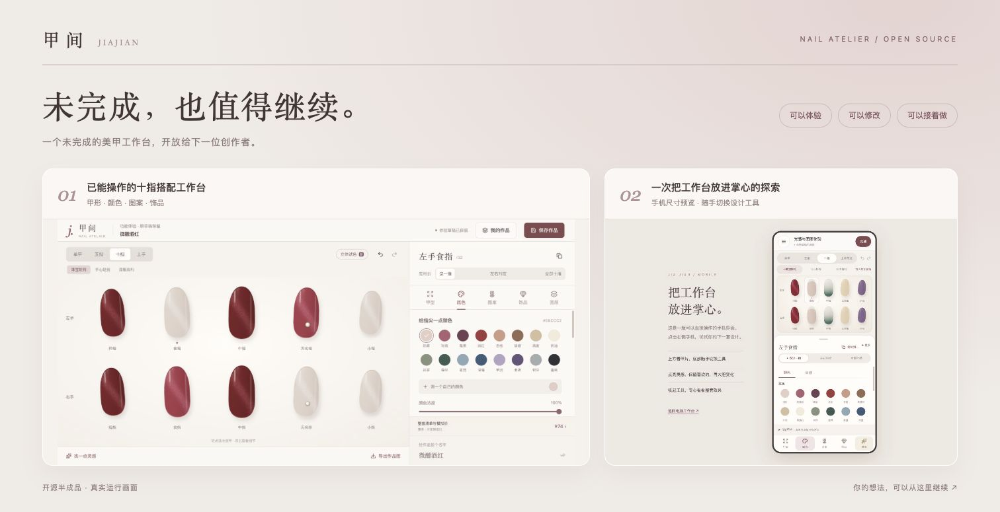
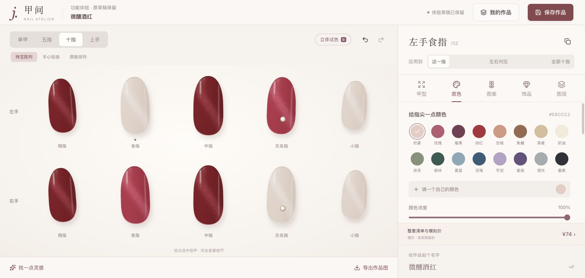
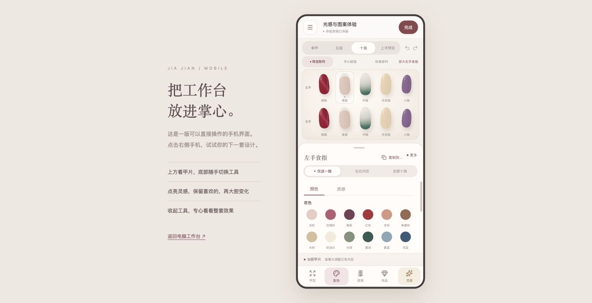

# 甲间 · Jiajian Nail Atelier

一个可以自由搭配颜色、甲形、图案和饰品的美甲设计工作台。从一片指甲开始，慢慢搭出属于自己的整套风格。

开源实验项目，欢迎使用、修改和继续探索。

## 能做什么

- 为单指、五指或十指搭配颜色、甲形、图案和饰品。
- 查看设计、生成灵感、保存作品和导出作品图。
- 在预览版探索猫眼、光泽、材质效果及手机尺寸下的工作台。
- 使用默认手部素材查看示意，不必先上传自己的照片。

## 看看实际画面

**电脑工作台：从一片指甲到完整十指搭配。** 可以套用灵感，再调整颜色、图案和饰品。

**手机预览：上方看设计，下方切换工具。**

以上为实际运行截图，效果仅作美甲设计参考。

## 开始体验

- [手机与光感预览使用指南](effect-preview/README.md)
- [电脑工作台使用指南](workbench/README.md)
- [下载开源版本](https://github.com/laizhihui874-cmd/jiajian/releases/latest)

## 开源与素材

自有代码按 [MIT License](LICENSE) 开源，欢迎使用、修改和继续开发。依赖和第三方素材保留各自许可，见 [素材与第三方说明](THIRD_PARTY_NOTICES.md)。
