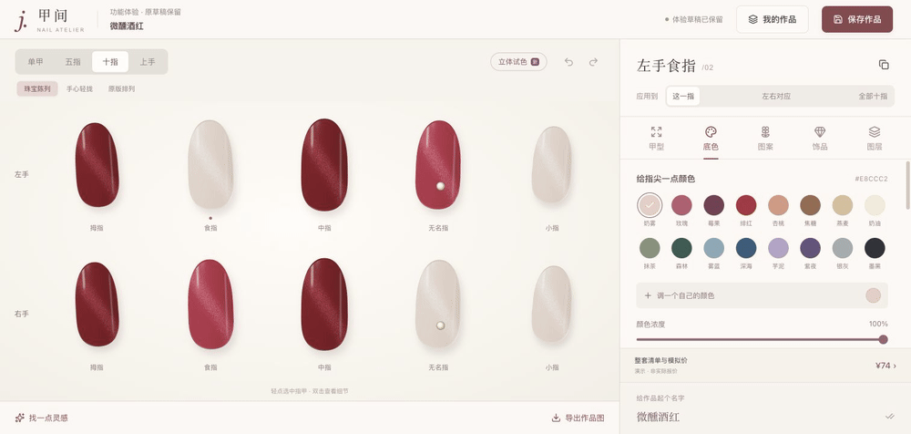

# 甲间 · 开放给下一位创作者

**一个未完成的美甲工作台，一份可以继续的创作起点。**

配色、甲形、图案、饰品与十指搭配，已经有了可以操作的起点。甲间还没有成为一个完整产品，但我们希望这些探索不止停留在这里。

所以，我们把它开源。你可以用它搭配自己的美甲，研究一个设计工具如何组织体验，也可以带着新的想法，把它继续做下去。

**[下载项目](https://github.com/laizhihui874-cmd/jiajian/releases/latest) · [开始体验](#开始体验) · [看看可以继续做什么](#下一步可以由你来写)**

## 已经做出的东西

**从一片指甲，到一整套搭配。**

选择甲形和颜色，加上图案与饰品；单独调整一指，或让十指一起变化。也可以从已有灵感出发，保留喜欢的部分，再慢慢改成自己的款式。

**让设计动起来，看见操作前后的变化。**

下面用真实操作的关键画面，展示一套搭配如何换色、再调整其中一指。保存喜欢的作品，也可以导出作品图。

**也探索过，把工作台放进掌心。**

上方看设计，下方切换工具。手机预览保留了另一种操作方式，光感与材质也还有值得继续打磨的空间。

*以上均来自实际运行页面，效果仅作美甲设计参考。*

## 你可以拿它做什么

| 如果你是…… | 可以从这里开始 |
|---|---|
| 美甲爱好者 | 玩一套自己的配色，试试不同甲形、图案与重点甲的组合 |
| 产品或界面设计师 | 研究十指搭配、工具切换、灵感选择这些具体体验，再提出自己的改法 |
| 想做创作工具的人 | 拿已有工作台继续改造，探索自己的美甲工具或其他搭配工具 |

## 下一步，可以由你来写

这是半成品。下面这些是值得继续探索的方向，欢迎选择你感兴趣的一项：

- **让第一步更容易**：让第一次打开的人更快理解怎么选、怎么改、怎么完成一套设计。
- **让手机操作更顺手**：继续打磨小屏上的预览、工具切换与细节调整。
- **让颜色与光感更自然**：改进猫眼、材质和手部展示，让不同视图中的效果更一致。
- **让作品更方便分享**：完善作品整理、导出与展示，把搭配过程和成果讲得更清楚。

它们是开放的探索方向，不是已经完成的功能或交付承诺。有想法可以[提出建议](https://github.com/laizhihui874-cmd/jiajian/issues)，也欢迎直接修改并分享你的版本。

## 开始体验

- [手机与光感预览使用指南](effect-preview/README.md)
- [电脑工作台使用指南](workbench/README.md)
- [下载开源版本](https://github.com/laizhihui874-cmd/jiajian/releases/latest)

## 自由使用，继续创作

自有代码以 [MIT License](LICENSE) 开源，欢迎使用、修改和继续开发。依赖和第三方素材保留各自许可，见[素材与第三方说明](THIRD_PARTY_NOTICES.md)。

如果甲间成为了你下一个作品的起点，欢迎回来分享。
